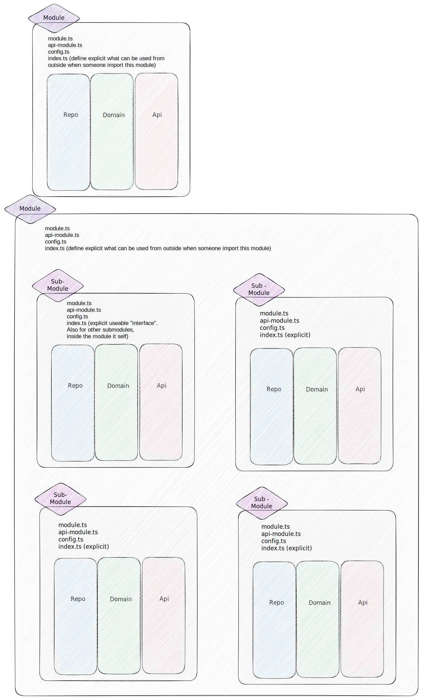
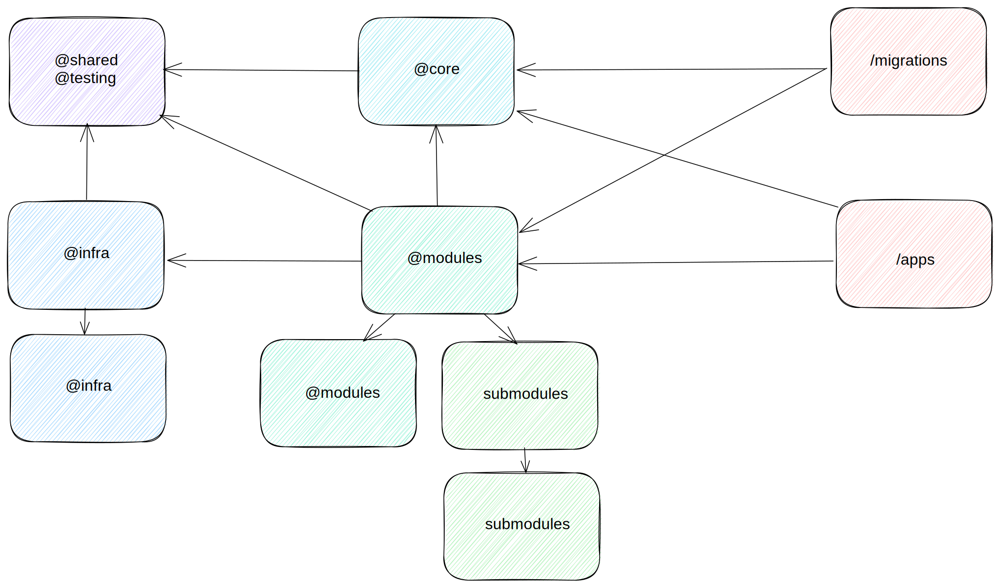

# Implementation and usage of modules, submodule and barrel files in our project

In this guide, we'll cover how to use modules, submodules and barrel files in our project. These concepts help you organize your code into separate files and directories, making it easier to manage and maintain.



## Modules and Submodules

In our project, modules are a way to create separate scopes. This means that interfaces, use cases, services, etc., declared in a module are not visible outside the module unless they are explicitly exported using the `export` keyword. To import a module, you use the `import` keyword followed by the module name. Here's an example:

```typescript
import { ModuleName } from '@modules/module-name';
```

Submodules are modules that are part of a larger module. They should be used within the main module. If it is necessary to use parts of the submodule outside the main module, the main module should export this via its barrel file(index.ts):

```typescript
// @modules/module-name/index.ts
export { SubmoduleServiceName } from './submodule-name/service.ts';
```

## Barrel Files

Barrel files are a way to rollup exports from several folders into a single convenient nest-module. The barrel itself is a module file that re-exports selected exports of other submodules.

If you have several related service/interface files in a directory/module that should be publicly accessible, you can create a barrel file to export all these files from the main module again.

Here's an example of a barrel file:

```typescript
// @modules/module-name/index.ts
export { PublicService } from './services/public-service.ts';
export { ServiceInterfaceA, InterfaceB } from './interfaces';
export { InterfaceC } from './submodule-name/interfaces';
```

!!! Please don't export everything from a module in the barrel file. Only export the public API of the module. This will make it easier to understand what the module provides and avoid unnecessary dependencies. And don't use wildcard exports like `export * from './services'` in the barrel file.

And here's how you can import from the barrel:

```typescript
// @modules/other-module-name/service.ts
import { PublicService, InterfaceOfModule, InterfaceOfSubmodule } from '@modules/module-name';
```

## Dependencies between Modules

Our Modules are split into different areas, most importantly `core`, `infra`, and `modules`.

`modules` contains all of our domain modules, that handle aspects of our business logic. `infra` contains mostly adapters to external system, generated clients, as well as purely technical modules. `core` contains indispensible modules like errorhandling and logging, that are needed by almost every other module.

Aside of these major areas, there is also `testing`, which contains modules and code that are only needed to implement tests, as well as `shared`, which still contains helpers and other things that are used by multiple modules. However `shared` is considered depricated, and new code should not be added there.

To avoid dependency cycles, we keep a strict hierarchy between these areas. `shared` and `testing` are not allowed to have any dependencies outside these areas. `infra` and `core` may use `shared` and `testing`, but never `modules`. `modules` are generally free to use other modules, but need to take special care to avoid cycles in their dependencies to other modules.

The `apps` are our outermost layer of code, where the applications as a whole are assembled. Finally, our `migrations` exist outside the rest of the code, but like the apps may make use of modules.



## Further Reading

* [Handling Dependency Cycles](./solving-dependency-cycles.md)
* [Architecture](../architecture.md)
