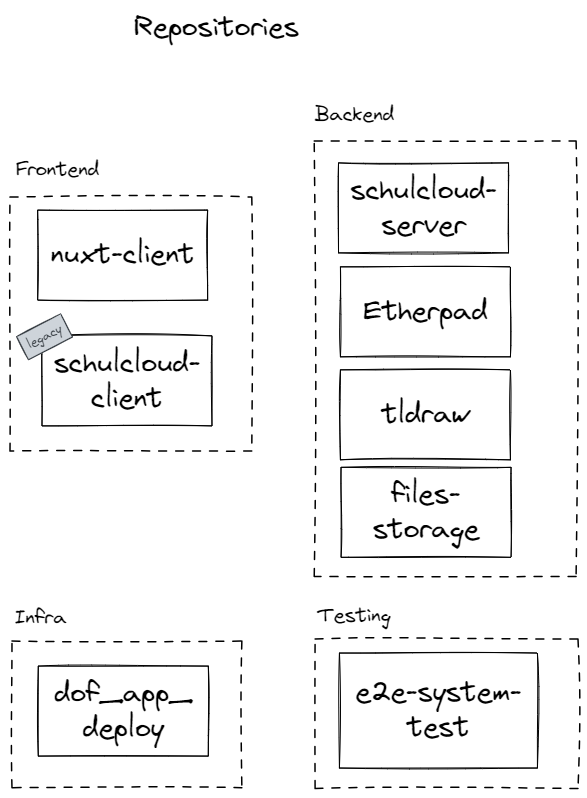

# Schulcloud Documentation

The schulcloud consists of many repositories.

You can find more information on each of these repositories under [systems](/docs/services)

For setting up a local Schulcloud, you at least need the `schulcloud-server`, `schulcloud-client` and `nuxt-client`.
