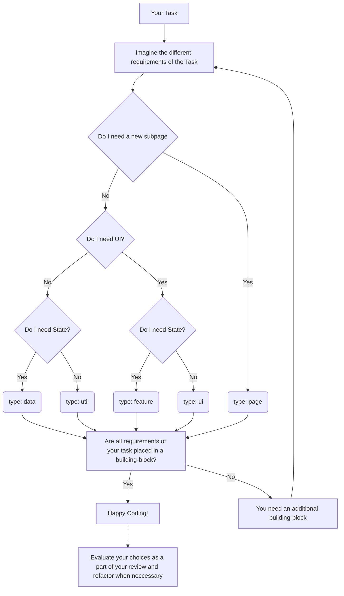

# Project Structure

## Filenames

Files should be consistently named like this:

| file content | style      | filename                                                         | comment                                                   |
| ------------ | ---------- | ---------------------------------------------------------------- | --------------------------------------------------------- |
| Components   | PascalCase | `YourComponent.vue`                                              | best practice                                             |
| Layouts      | PascalCase | `YourLayoutName.layout.vue`                                      | best practice                                             |
| Pinia stores | PascalCase | `@/stores/BoardCardStore.ts`                                     | suggestion: subfolder stores/ include Store in filename   |
| Composables  | CamelCase  | `confirmationDialog.composable.ts` or `useConfirmationDialog.ts` | **TBD**                                                   |
| Utils        | CamelCase  | `yourArea.util.ts`                                               | suggestion: move from yourUtil.ts => your.util.ts         |
| other files  | CamelCase  | `your-filename.ts`                                               |                                                           |
| test files   |            | `{{ basename }}.unit.ts`                                         | e.g. YourComponent**.unit.ts**, yourArea.util**.unit.ts** |

## Folders

Folders are written in **KebabCase** (e.g. `feature-board`).

## Building Blocks

The project's code is separated into building blocks.

### What is a building-block?

A **building-block** is a "container" were we place most of our applications logic and components. Each building-block is defined by an `index.ts (Barrel-File)` describing it's exported content (public API of a building-block) and a `type`.

Utilizing linting rules and the index.ts we can ensure that each building-block only exposes files which are meant to be used application-wide. This way we achieve a strong separation of concern across the whole application.

Our linting rule is based on the following concept: [Enforce Project Boundaries | Nx](https://nx.dev/core-features/enforce-project-boundaries)

_Note: in above documentation **libraries** are equivalent to building-blocks and **tags** represent the types defined below._

**near future**: All newer modules, that already follow our naming convention (see link above), will move from "components/" into a central "modules/" folder with one subfolder for each type of module (`page/`, `data/`, `feature/`, `ui/`, `util/` ).

### Types of building-blocks

There are different types of building blocks each with a different purpose.

| type    | example                                               | comment                                                                                                                                                                                            |
| ------- | ----------------------------------------------------- | -------------------------------------------------------------------------------------------------------------------------------------------------------------------------------------------------- |
| Page    | modules / **`page`** / dashboard                      | Contains a subpage of the application. Orchestrates Feature and UI building-blocks.                                                                                                                |
| Feature | modules / **`feature`** / calendar                    | Complex features with **stateful / smart components**. Usually specialized to fulfill specific roles in the App. Can also contain presentational components that are specialized for this feature. |
| UI      | modules / **`ui`** / forms                            | **Stateless / presentational components** which get their data via props and emit events. Usually less specialized.                                                                                |
| Data    | modules / **`data`** / auth                           | State and API-access. Does not contain any visual components. They are the data-sources of all smart components.                                                                                   |
| Util    | <nobr> modules / **`util`** / form-validators </nobr> | Contains shared low-level code.                                                                                                                                                                    |

#### Matrix of allowed imports

Each type is only allowed to import modules of some of the other types.

| &nbsp; &nbsp; &nbsp; &nbsp; &nbsp; &nbsp; &nbsp; &nbsp; &nbsp; &nbsp; &nbsp; &nbsp; &nbsp; &nbsp; &nbsp; &nbsp; Allowed to Import &#8594;   It is &#8595; | page | feature | data | ui  | util |
| :------------------------------------------------------------------------------------------------------------------------------------------------------------ | ---- | ------- | ---- | --- | ---- |
| page                                                                                                                                                          |      | ✔       | ✔    | ✔   | ✔    |
| feature                                                                                                                                                       |      | ✔       | ✔    | ✔   | ✔    |
| data                                                                                                                                                          |      |         | ✔    |     | ✔    |
| ui                                                                                                                                                            |      |         |      | ✔   | ✔    |
| util                                                                                                                                                          |      |         |      |     | ✔    |

#### Type: Page

A page building-block represents a **subpage** of the application. It contains the layout component and orchestrates feature and ui building blocks to create a subpage. It can not be imported into any other type of building-block. It is **only imported by the vue-router** and should be **lazy-loaded** if possible.

#### Type: Feature

A feature building-block contains a set of files that represent a business use case in an application.

Most of the components of features are **stateful / smart components** that interact with data sources. This type also contains most of the UI logic, form validation code, etc.

#### Type: UI

A ui building-block mainly contains **Stateless / presentational components** which are used all across the application. They don't have access to stores and do not use features in their templates. All data needed for components in ui building-blocks comes from props.

#### Type: Data

A data building-block contains **stores and api-services**. It does not contain any view components. They serve as data-sources for feature and page building blocks.

#### Type: Util

A utility building-block contains **low level code** used by many building-blocks. Often there is no framework-specific code and the building-block is simply a collection of types, utilities, pure functions, factories or composables.

Placed in folder **util**

### Live of a feature module

#### Starting a new Feature module

1. create a new subfolder inside of `modules/feature/`-folder and give it a speaking name
2. place any files of different purposes (for ui, data and/or util) inside of it.
3. provide a barrel-file **index.ts** that defines it's exposed API - the functionality that other modules are allowed to use. This should only export the bare minimum.

#### Another module needs access to the data of your feature

1. do not export your data-functionality from your feature
2. refactor your feature-module and extract the data part of it into a new data-module
3. use this new data-module in the original feature and the other module that also needs access

_Note: if you now upfront, which parts will definitly be used outside your feature, implement the data-module upfront_

#### Another module needs access to some of your UI-Components that form your feature

1. do not export these components simply from your feature
2. if the components are simple / dumb and do not need data-access: consider extracting them into a separate **ui-module** _(example: ui/preview-image)_
3. if the components are coupled with some data-functionality but this does not belong to the core of your feature: consider extracting those parts into a separate **feature-module** _(example: feature/alert-list)_

_Note: if you are sure that a part of your feature, will be reused in the project - consider extracting it from your ticket - before implementation - and implement it first._

### How to pick the correct type for my Task

`To render this graph in VS-Code markdown preview install this extension: bierner.markdown-mermaid`

