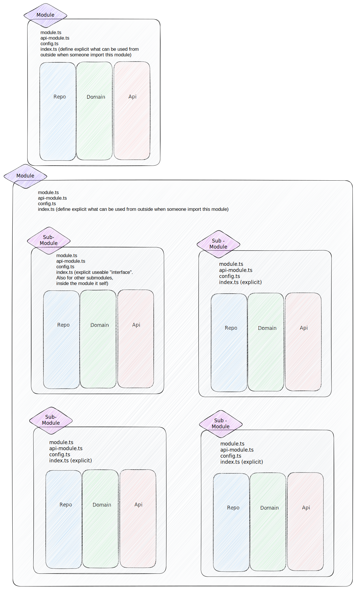
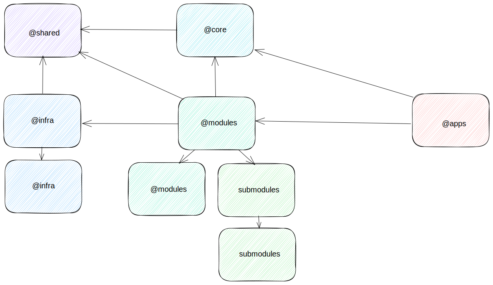

# Implementation and usage of modules, submodule and barrel files in our project

In this guide, we'll cover how to use modules, submodules and barrel files in our project. These concepts help you organize your code into separate files and directories, making it easier to manage and maintain.



## Modules and Submodules

In our project, modules are a way to create separate scopes. This means that interfaces, use cases, services, etc., declared in a module are not visible outside the module unless they are explicitly exported using the `export` keyword. To import a module, you use the `import` keyword followed by the module name. Here's an example:

```typescript
import { ModuleName } from '@modules/module-name';
```

Submodules are modules that are part of a larger module. They should be used within the main module. If it is necessary to use parts of the submodule outside the main module, the main module should export this via its barrel file(index.ts):

```typescript
// @modules/module-name/index.ts
export { SubmoduleServiceName } from './submodule-name/service.ts';
```

## Barrel Files

Barrel files are a way to rollup exports from several folders into a single convenient nest-module. The barrel itself is a module file that re-exports selected exports of other submodules.

If you have several related service/interface files in a directory/module that should be publicly accessible, you can create a barrel file to export all these files from the main module again.

Here's an example of a barrel file:

```typescript
// @modules/module-name/index.ts
export { PublicService } from './services/public-service.ts';
export { ServiceInterfaceA, InterfaceB } from './interfaces';
export { InterfaceC } from './submodule-name/interfaces';
```

!!! Please don't export everything from a module in the barrel file. Only export the public API of the module. This will make it easier to understand what the module provides and avoid unnecessary dependencies. And don't use wildcard exports like `export * from './services'` in the barrel file.

And here's how you can import from the barrel:

```typescript
// @modules/other-module-name/service.ts
import { PublicService, InterfaceOfModule, InterfaceOfSubmodule } from '@modules/module-name';
```

## Handling Circular Dependencies

Circular dependencies occur when Module A depends on Module B, and Module B also depends on Module A. This can lead to unexpected behavior and hard-to-diagnose bugs.



Here are some strategies to handle circular dependencies:

1. **Refactor Your Code**: The best way to handle circular dependencies is to refactor your code to remove them. This might involve moving some code to a new module to break the dependency cycle.

```typescript
// @modules/moduleC/service.ts
import { PublicService, InterfaceOfModule, InterfaceOfSubmodule } from '@modules/moduleA';
import { PublicService, InterfaceOfModule, InterfaceOfSubmodule } from '@modules/moduleB';
```

2. **Use Interfaces**: If the circular dependency is due to types, you can use interfaces and type-only imports to break the cycle.

```typescript
// @modules/moduleC/service.ts
import { type PublicService } from '@modules/moduleA';
import { type PublicService } from '@modules/moduleB';
```

3. **Use Events**: If you have a circular dependency between two modules that need to communicate with each other, consider using events to decouple them. This way, one module can emit an event that the other module listens to, without directly importing it.

- <https://documentation.dbildungscloud.dev/docs/schulcloud-server/Coding-Guidelines/event-handling>

- <https://docs.nestjs.com/recipes/cqrs>

Remember, circular dependencies are usually a sign of tightly coupled code and can lead to maintenance issues down the line. It's best to refactor your code to avoid them if possible.
