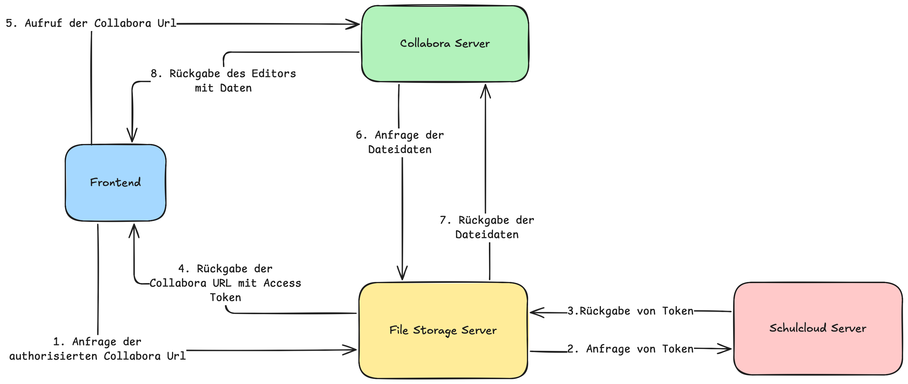

# How Collabora Works

Collabora is an online office suite that enables collaborative editing of documents, spreadsheets, and presentations directly in the browser. It integrates with Schulcloud to provide users with real-time editing capabilities and support for rich document formats like ODT, DOCX, XLSX, and PPTX.

## Key Features

- Real-time collaborative editing
- Support for multiple document formats
- Track changes and comments
- Integration with Schulcloud file storage
- User access control and permissions

## Workflow

1. A user opens a document in Schulcloud using Collabora.
2. The document is loaded in the browser and can be edited by multiple users simultaneously.
3. Changes are synchronized in real time, and users can see each other's edits.
4. Documents are saved back to Schulcloud File Storage automatically or on demand.

## Use Cases

- Collaborative lesson planning
- Group assignments
- Real-time feedback on student work

---

