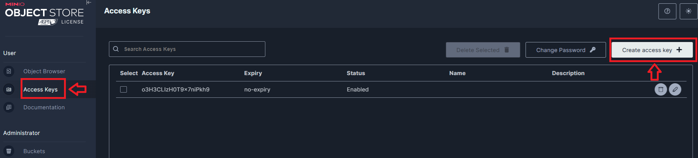
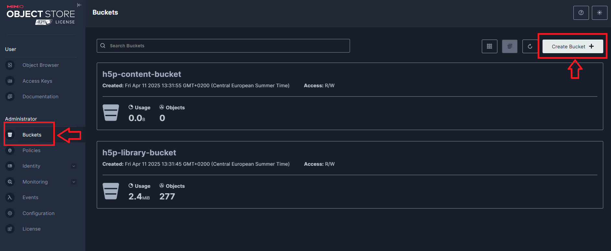
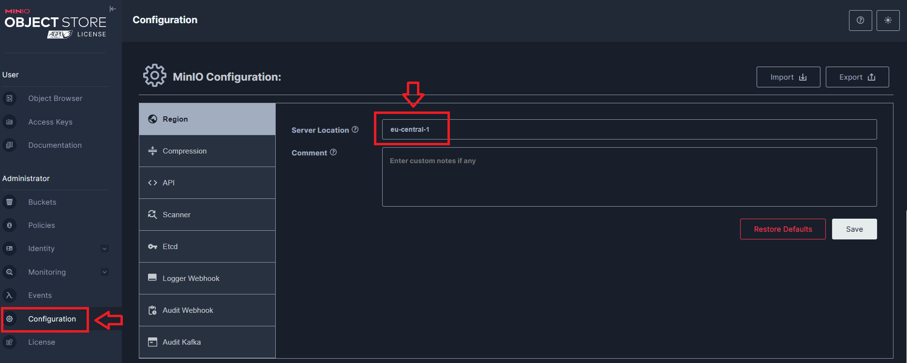

# Local setup

## Introduction
The documentation here is ported from Confluence. Link to the original documentation on Confluence: <br/>
https://docs.dbildungscloud.de/display/N21P/How+to+setup+h5p+locally

This documentation relates to [N21-2501](https://ticketsystem.dbildungscloud.de/browse/N21-2501) and aims to help developers to setup the servers and dependencies required 
to implement and test h5p in boards. At the end of the setup, you should be able to run and use the h5p-editor and 
h5p-library-management apps without any failures.

Here are further informations about h5p from the original docu by [Team Capybara](https://docs.dbildungscloud.de/display/DBH/H5P-Editor)


## Requirements

- Docker
- Git


## Steps

### Setting up a local S3 storage

**If you already have a local S3 storage running, skip this step.**

[minio](https://min.io/docs/minio/container/index.html) will be run in docker for storing h5p contents and libraries locally. You can start it with the following docker command:

```bash
docker run \
  --name minioS3storage \
  -p 9000:9000 \
  -p 9001:9001 \
  -e "MINIO_ROOT_USER=miniouser" \
  -e "MINIO_ROOT_PASSWORD=miniouser" \
  quay.io/minio/minio server /data --console-address ":9001"
```
If the ports 9000 or 9001 are not available for your local machine, then use (pay special attention to the ports here!):

```bash
docker run \
  --name minioS3storage \
  -p 9100:9000 \
  -p 9101:9001 \
  -e "MINIO_ROOT_USER=miniouser" \
  -e "MINIO_ROOT_PASSWORD=miniouser" \
  quay.io/minio/minio server /data --console-address ":9001"
```
Or if you have a docker-compose file, add the service and volume for minio:

*docker-compose.yml*
```yml
services:
  minio-s3-storage:
    image: quay.io/minio/minio:latest
    command: server /data --console-address ":9001"
    restart: always
    ports:
      - '9000:9000'
      - '9001:9001'
    environment:
      - MINIO_ROOT_USER=miniouser
      - MINIO_ROOT_PASSWORD=miniouser
    volumes:
      - 'minio:/data'
 
volumes:
  minio:
```

If the ports 9000 or 9001 are not available for your local machine, then use (pay special attention to the ports here!):

*docker-compose.yml*
```yml
services:
  minio-s3-storage:
    image: quay.io/minio/minio:latest
    command: server /data --console-address ":9001"
    restart: always
    ports:
      - '9100:9000'
      - '9101:9001'
    environment:
      - MINIO_ROOT_USER=miniouser
      - MINIO_ROOT_PASSWORD=miniouser
    volumes:
      - 'minio:/data'
 
volumes:
  minio:
```

See also: [Local Project Setup](https://docs.dbildungscloud.de/pages/viewpage.action?pageId=203882620#LocalProjectSetup/Projektlokaleinrichten(WIP)-LokalesFileSystem)


### Configuring the local S3 storage

Sign in via to your local s3 storage (minio via http://localhost:9001 or http://localhost:9101 with username: miniouser, pw: miniouser).

If not yet done, create an access key pair. Make sure to store the access key secret well, as you cannot re-read it after creation.



Then, add two buckets for the h5p contents and libraries with the following names:
- h5p-content-bucket
- h5p-library-bucket



You may also use any other names you prefer or even just use one bucket. If you do, make sure you adapt to the rest of the steps correctly.

This is optional, you can also change the s3 region to **eu-central-1**. If you decided not to change the region, please note that the default s3 region for minio is **us-east-1**.



### Configuring h5p for the schulcloud-server

Several environment variables are needed for both the h5p-editor and h5p-library management to run. Add the following variables to the local .env file

.env
```
H5P_EDITOR__S3_ENDPOINT=http://localhost:9000
H5P_EDITOR__S3_REGION=eu-central-1
 
H5P_EDITOR__S3_BUCKET_CONTENT=h5p-content-bucket
H5P_EDITOR__S3_ACCESS_KEY_ID=<LOCAL_S3_KEY_ID>
H5P_EDITOR__S3_SECRET_ACCESS_KEY=<LOCAL_S3_KEY_SECRET>
 
H5P_EDITOR__S3_BUCKET_LIBRARIES=h5p-library-bucket
H5P_EDITOR__LIBRARIES_S3_ACCESS_KEY_ID=<LOCAL_S3_KEY_ID>
H5P_EDITOR__LIBRARIES_S3_SECRET_ACCESS_KEY=<LOCAL_S3_KEY_SECRET>
```
Make sure to adapt the values of the variables according to what you have.

Alternatively, you can also just change the values in the [development.json ](https://github.com/hpi-schul-cloud/schulcloud-server/blob/main/config/development.json file).
However, the development config file does not contain all the required fields. You will need to adapt the file locally. Also, note that the values from the environment variables will override those in the development config file.

### Testing the h5p-library-management app

At this point, you have nearly everything for the library management app. You just need to specific which libraries to install in the schulcloud-server config/h5p-libraries.yaml.
For example:

h5p-libraries.yaml

```yaml
h5p_libraries:
  - H5P.ArithmeticQuiz
  - H5P.Chart
```
This [misc.yml](https://github.com/hpi-schul-cloud/dof_app_deploy/blob/main/ansible/group_vars/all/misc.yml#L15) in dof-app provides a list of possible h5p libraries. After configuring the libraries, you can run the library management app with the command (or via your IDE using the package.json):

```bash
npm run nest:start:h5p:library-management
```

After the app had finished running, check in the h5p-library-bucket, if the library files are successfully installed.

You may run into problems while running the app, the [troubleshooting](#Troubleshooting-setup-problems) below contains information to help you solve them.

If you remove any of the the folders in the bucket, remember to remove the corresponding metadata from mongodb in the "h5p-library" collection!

### Setting up the h5p static files server

Run the h5p-editor from lumi-education in the client, a static file server is needed. See [H5P-Nodejs-Library-Serving static H5P core files for the client](https://docs.lumi.education/usage/integrating#serving-static-h5p-core-files-for-the-client)

Clone/pull the latest repo of the [h5p-staticfiles-server](https://github.com/hpi-schul-cloud/h5p-staticfiles-server)

```bash
git clone https://github.com/hpi-schul-cloud/h5p-staticfiles-server.git
```

Build with docker an image of the h5p-staticfiles-server:

```bash
cd ./h5p-staticfiles-server
docker build --network=host -t=h5p-staticfiles-server .
```

The --network option is to avoid any possible problems regarding dns resolution which often occurs with docker in wsl. You may remove it, if it does not affect you.

Lastly, you can run the static files server:

```bash
docker run -p 8080:8080 -d --name=h5p-staticfiles-server h5p-staticfiles-server
```

Or if you have a docker compose file. Add the following service:

docker-compose.yml

```bash
services:
  ...
  h5p-staticfiles-server:
    build:
      context: .
    image: h5p-staticfiles-server
    restart: always
    ports:
      - '8080:8080'
```
If the port 8080 is already in used, change the first "8080" to another valid port number. Do take note of this port number; it is important.

Open a browser and test that the static files server is working correctly with the following url:

- http://localhost:8080/ping
- http://localhost:8080/h5pstatics/editor/images/add.png

The first url should show you the text "pong", the second a picture of a green plus.

**IMPORTANT**

Each time the h5p-staticfiles-server repo is updated, you will have to redo the steps here to make sure the h5p-editor works properly.


### Testing the h5p-editor app

Before starting the h5p-editor app, make sure to:

**Run the latest schulcloud-server, -client and nuxt-client**

Update or clone the latest version of the schulcloud-server, client and nuxt-client. Make sure the code changes from [N21-2501](https://ticketsystem.dbildungscloud.de/browse/N21-2501) is in your local repo.
See: [Local Project Setup](https://docs.dbildungscloud.de/pages/viewpage.action?pageId=203882620#LocalProjectSetup/Projektlokaleinrichten(WIP)-InstallationinWindows)

Enable the feature flag "FEATURE_H5P_EDITOR_ENABLED" in the .env of the schulcloud-client (old client)

.env
```
FEATURE_H5P_EDITOR_ENABLED=true
```

**Run the file-storage app locally**

The file-storage app is located in the schulcloud-server repo. Before starting the file-storage, make sure to configure the file-storage app properly. The configurations are in the

.env
```
FILES_STORAGE__S3_ENDPOINT=http://localhost:9000
FILES_STORAGE__S3_ACCESS_KEY_ID=<YOUR_LOCAL_S3_KEY_ID>
FILES_STORAGE__S3_SECRET_ACCESS_KEY=<YOUR_LOCAL_S3_KEY_SECRET>
FILES_STORAGE__S3_BUCKET=schulcloud
FILES_STORAGE__S3_REGION=eu-central-1
```
Make sure that the s3 bucket "schulcloud" is created in the s3 storage (minio). This is not needed for the h5p editor to run, but to completely setup the file-storage app you will also need to add an entry into the "file-storage" collection. See [Local Project Setup-Lokales File System](https://docs.dbildungscloud.de/pages/viewpage.action?pageId=203882620#LocalProjectSetup/Projektlokaleinrichten(WIP)-LokalesFileSystem)

After configuring the file-storage app, you can run the app with the following command:

```bash
npm run nest:start:files-storage
```

**Check that the h5p-staticfiles-server is running**

This should already be done in the previous step.

If you changed the port number of the h5p-staticfiles-server, you will need to change it in the [dev-server-config.js](https://github.com/hpi-schul-cloud/nuxt-client/blob/main/config/webpack/dev-server-config.js#L45) of the nuxt-client as well

**Start and test the h5p-editor**

You can start the h5p-editor app via the command (or via package.json):

```bash
npm run nest:start:h5p
```

To test if the h5p-editor works:

1. Sign into your local instance of SVS as a teacher
2. Create a course
3. Create a topic with h5p content
4. Edit the h5p content

If everything works you should see a new window appear with the h5p-editor. The editor should contains the library you installed via the h5p-library-management app.

You may further test if the library works by creating a content out of the library.

## Troubleshooting setup problems

This section lists several problems that may occur when setting up h5p locally and possible solutions to them. If you found any problems/solutions yourself, you are welcomed to add it to this section :smile:

### I cannot open the minio console (connection refused)

Remove the docker container for minio, then run the minio container again.

Check if the ports in your docker command/compose file are correct. If you change the 9001 port to another port number, the port to access the minio console will change to the other port number!

### Socket hang up/network error when connecting to the API server of minio

If you are using docker in WSL, the problem could be that your apps (i.e. file-storage, h5p-library-management) than are run in the windows environment is unable to resolve the exact "localhost" ip address of the minio api server (usually localhost:9000).

A quick workaround for this is by replacing "localhost" in the H5P_EDITOR__S3_ENDPOINT with the aforementioned exact ip address. This can be determined via the command:

```bash
wsl hostname -I
```

.env
```
H5P_EDITOR__S3_ENDPOINT=http://172.27.120.97:9000 # just an example
```

You may be presented with multiple ip addresses. If this is the case, then you will need to find the correct one via try-and-error (replacing **localhost** with each address and re-rerunning the app until no error is thrown). This is just an assumption, but the correct ip address seems to not end with XXX.XX.0.1.

Another workaround is to run your apps in the wsl. The connection is then run in the wsl network, removing the need to resolve **localhost**"** between the windows and wsl network.

The real solution to this is probably to configure network or dns resolution wsl or the docker in wsl correctly. This is out of scope of this documentation and should be solved independently by yourself.

### Package validation failed while installing h5p-libraries

This problem occurs when you start the h5p-library-management app and the h5p-libraries are not installed because of the following error:

```
Error: package-validation-failed:api-version-unsupported (component: H5P.MarkTheWords-1.11, current: 1.24, required: 1.27)
```

The message is confusing, but it means that the @lumieducation/h5p-server version that is currently installed is incompatible with the library (here above shown as component) you specified. The only solutions here are either install a compatible version of @lumieducation/h5p-server (usually by updating its version number in the package.json) or remove the incompatible library from the
[schulcloud-server/config/h5p-libraries.yaml](https://github.com/hpi-schul-cloud/schulcloud-server/blob/main/config/h5p-libraries.yaml).

The library-management-app runs without error, but I see no library files installed in the bucket

The app does not read from s3 which files or folders already exist. It records an entry in the "h5p-library" collection for each library that is installed. The s3 and the mongodb collection can naturally be desynced i.e. mongodb says library A exists in the collection, but the files for library A does not exist in s3. So, the app did not install the files in s3. To solve this, you can either:

- remove all library files and folders from s3 and clear the "h5p-library" collections, run the library-management app
- remove all the specified library in [schulcloud-server/config/h5p-libraries.yaml](https://github.com/hpi-schul-cloud/schulcloud-server/blob/main/config/h5p-libraries.yaml) ,run the library-management app, add your list of libraries again, run the library-management app

You may notice that the removal of libraries in [schulcloud-server/config/h5p-libraries.yaml](https://github.com/hpi-schul-cloud/schulcloud-server/blob/main/config/h5p-libraries.yaml) does not remove the files in s3, it is unknown if it is a feature or bug in the library-management app.

