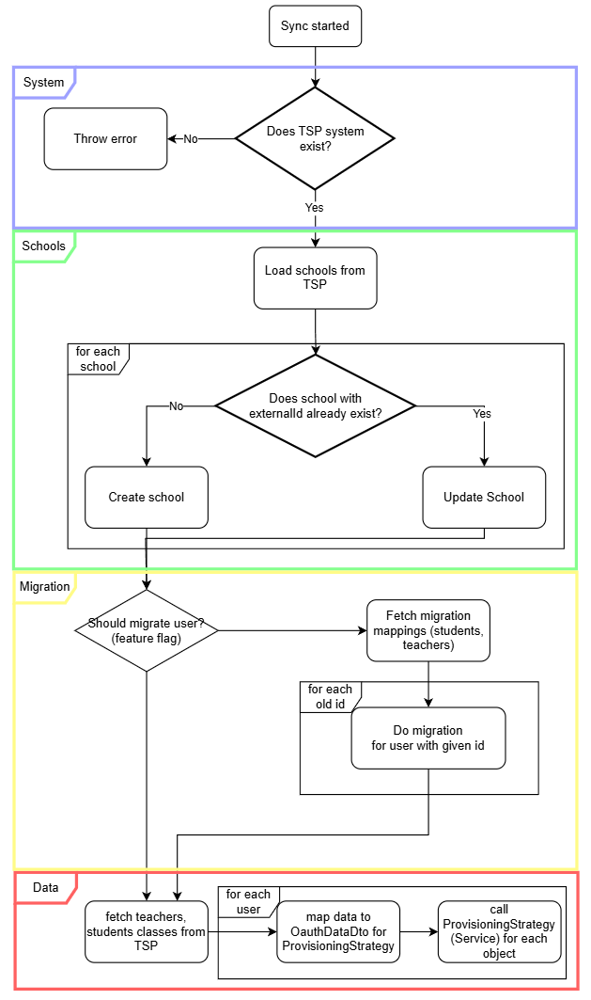

# Architecture

## TspSyncStrategy

This strategy handles the sync of schools, students, teachers and classes from TSP and replaces both the legacy TspBaseSyncer and TspSchoolSyncer. It responds to the target "tsp".

The flow looks like this (some of the logic for syncing is done in the provisioning strategy which is shared with the login):

