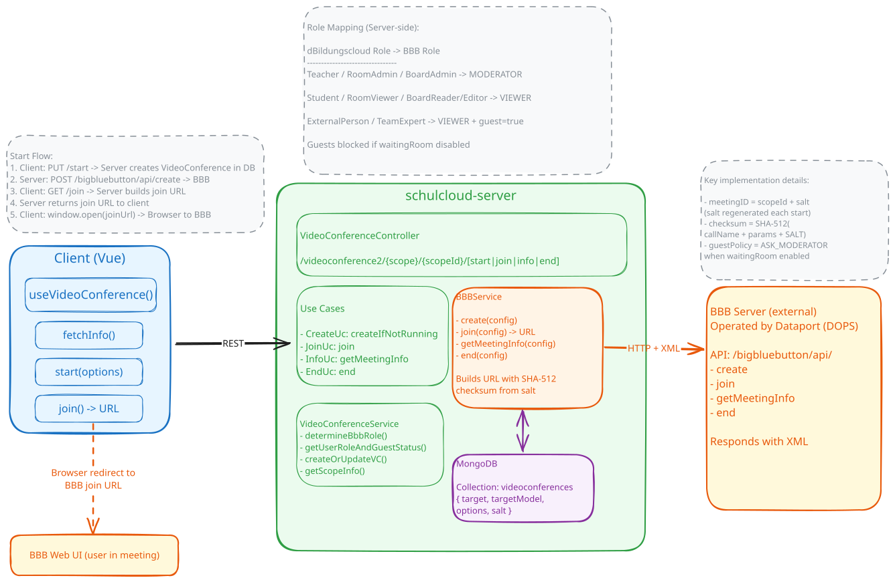
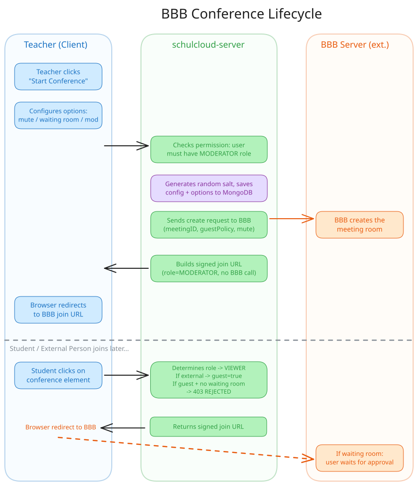

# BigBlueButton (BBB) – Video Conferencing

The dBildungscloud integrates [BigBlueButton](https://bigbluebutton.org/) as its video conferencing solution. Teachers can start conferences within courses or board elements, students and external persons can join them. Communication with BBB runs exclusively through the server – the client only manages the lifecycle (create, join, check status) and ultimately redirects to the BBB URL.

## Features

- **muteOnStart** – Moderator can mute all participants when they enter
- **everybodyJoinsAsModerator** – Moderator can grant moderator rights to all participants
- **Waiting Room (moderatorMustApproveJoinRequests)** – Participants must be approved by a moderator before joining the conference
- **External Persons** – Can participate in conferences, but only when the waiting room is enabled (see [Access Logic for External Persons](#access-logic-for-external-persons))

## Where is BBB integrated?

BBB can be used in different contexts ("scopes"):

| Scope | Description | Entry Point |
| --- | --- | --- |
| `course` | Video conference within a course room | `RoomVideoConferenceSection.vue` |
| `video-conference-element` | Video conference as a board element (column board) | `VideoConferenceContentElement.vue` |
| `room` | Room (available in API) | – |
| `event` | Calendar event (available in API) | – |

> **For extensions:** If BBB needs to be integrated in a new context, the existing composable `useVideoConference(scope, scopeId)` can be reused – it is scope-agnostic.

## Board-Element Integration

The board element (`VideoConferenceContentElement.vue`) is the primary integration point. Key behaviors:

- Opens BBB in a new tab (`_blank`)
- Prefetches the join URL on mount when a conference is already running – for faster join experience
- Start permission is controlled via `allowedOperations.manageVideoConference` (board-specific)
- Join permission is role-based: Student, Teacher, or External Person with waiting room active
- Requires both `FEATURE_VIDEOCONFERENCE_ENABLED` and `FEATURE_COLUMN_BOARD_VIDEOCONFERENCE_ENABLED`, plus the server-side board feature flag

> **Note:** BBB is also still used in the legacy course-room context (`RoomVideoConferenceSection.vue`), which opens BBB in the same tab and uses `Permission.START_MEETING` / `Permission.JOIN_MEETING` directly.

## Access Logic for External Persons

External persons may only join a BBB conference under certain conditions. The client-side logic:

```
canJoin = canJoinMeeting && (!isExternalPerson || userRoles.length > 1 || isWaitingRoomActive)
```

This means: An external person can only join if:

- the waiting room is enabled (so the moderator can manually approve them), or
- the person has additional roles (i.e. is not solely `EXTERNAL_PERSON`)

## Architecture Overview

### Overview



### Sequence Flow



### Communication Flow

```
Client                          Server                              BBB Server (ext.)
──────                          ──────                              ─────────────────
GET  .../info  ───────────────► checks BBB status ─── GET /api/getMeetingInfo ──► XML response
PUT  .../start {options} ─────► permission check → save to DB → POST /api/create ──► creates room
GET  .../join  ───────────────► determines role + guest → builds signed URL (no BBB call)
                ◄── { url } ──
window.open(url) ──────────────────────────────────────────────────────────────────► BBB Web UI
```

### Key Server Internals

- **meetingID** = `scopeId + salt` (salt is a random 16-byte hex, regenerated on each start)
- **Checksum**: SHA-512 of `callName + queryParams + VIDEOCONFERENCE_SALT` (env variable)
- **BBB communication**: HTTP GET/POST, responses are XML (parsed with `xml2json`)
- **join()** does NOT call BBB – it only constructs a signed URL that the browser opens directly
- **Role mapping**:

  | dBildungscloud Role                       | BBB Role    | guest flag |
    | ----------------------------------------- | ----------- | ---------- |
  | Teacher / RoomAdmin / BoardAdmin          | `MODERATOR` | false      |
  | Student / RoomViewer / BoardReader/Editor | `VIEWER`    | false      |
  | ExternalPerson / TeamExpert               | `VIEWER`    | **true**   |

- **Guest blocking**: guest + no waiting room → 403 `GUESTS_CANNOT_JOIN_CONFERENCE`
- **GuestPolicy**: waiting room enabled → `guestPolicy=ASK_MODERATOR` sent to BBB create
- **everybodyJoinsAsModerator**: on join, if enabled AND user is not guest → role overridden to `MODERATOR`
- **allowModsToUnmuteUsers**: always `true` in the create config

## Local Setup

### Prerequisites

- BBB credentials **HOST** and **SALT** (from the password vault)
- Role permissions: `START_MEETING`, `JOIN_MEETING`
- School feature `videoconference` in the `features` array of the school (DB: table `schools`)

### Server Env

```
FEATURE_VIDEOCONFERENCE_ENABLED=true
VIDEOCONFERENCE_HOST=https://bbb.staging.messenger.schule/bigbluebutton
VIDEOCONFERENCE_SALT=<from password vault>
FEATURE_COLUMN_BOARD_VIDEOCONFERENCE_ENABLED=true
```

### Client Env

```
FEATURE_VIDEOCONFERENCE_ENABLED=true
```

### Database Structure

When a video conference is created (e.g. a teacher activates the feature for a course), an object is created in the `videoconferences` table:

```json
{
	"_id": "ObjectId(...)",
	"target": "<COURSE_ID>",
	"targetModel": "courses",
	"options": {
		"everyAttendeJoinsMuted": true,
		"everybodyJoinsAsModerator": false,
		"moderatorMustApproveJoinRequests": false
	},
	"salt": "<SALT_VALUE>"
}
```

For board elements, `target` refers to the board element and `targetModel` is `"video-conference-elements"`.
