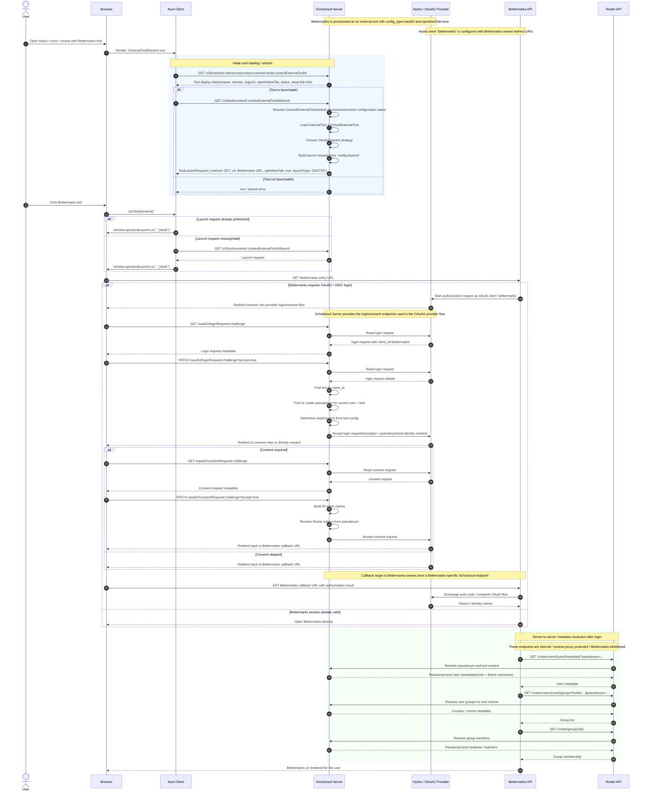

# Bettermarks integration flow

## Overview

Bettermarks is integrated as a generic OAuth2 external tool.
There is no dedicated Bettermarks runtime controller in the server code path for the launch itself.
Instead, the integration is composed of four cooperating parts:

1. **Client launch flow** in the browser and Nuxt client
2. **Tool launch generation** in `schulcloud-server`
3. **OAuth2 / OIDC provider flow** through the server's `/oauth2/*` endpoints and Hydra
4. **Server-to-server roster API calls** from Bettermarks back to Schulcloud

At deployment time, Bettermarks is provisioned as an external tool with:

- `config_type = oauth2`
- `openNewTab = true`
- a Hydra OAuth client
- Bettermarks-owned redirect URIs

That means the runtime flow is split into two major phases:

- **Launch and authentication**: browser-driven
- **Metadata and roster retrieval**: Bettermarks backend to Schulcloud backend

## Main components

- **Browser**: opens the Bettermarks tool in a new tab
- **Nuxt Client**: loads tool display data and prefetches the launch request
- **Schulcloud Server**: validates and builds the external-tool launch request
- **Hydra / OAuth2 Provider**: executes the OAuth2/OIDC login and consent flow
- **Bettermarks API**: receives the launch, completes OAuth2, and later fetches roster data
- **Roster API**: provides pseudonymized user and group metadata to Bettermarks

## Communication flow

### 1. Tool card loading in the client

When a board, room, or course page renders an external tool card, the client:

1. loads display data for the linked `ContextExternalTool`
2. optionally prefetches the launch request if the tool is launchable

This is done by the generic external-tool composables used by `ExternalToolElement.vue`.

### 2. Launch request generation in the server

When the client requests a launch URL, the server:

1. resolves the `ContextExternalTool`
2. resolves the related `SchoolExternalTool`
3. resolves the underlying `ExternalTool`
4. checks permissions and tool status
5. selects the launch strategy based on tool config type

For Bettermarks, the selected strategy is the OAuth2 launch strategy.
That strategy produces:

- `method = GET`
- `launchType = OAUTH2`
- `payload = null`
- `url = externalTool.config.baseUrl`

### 3. Browser launch

Because Bettermarks is configured with `openNewTab = true`, the client opens the returned launch URL in a new tab.

### 4. OAuth2 / OIDC flow

Once Bettermarks receives the browser request, it starts the OAuth2 / OIDC authorization flow using the configured OAuth client.

The Schulcloud server participates in this flow through its generic `/oauth2/*` endpoints:

- `GET /oauth2/loginRequest/:challenge`
- `PATCH /oauth2/loginRequest/:challenge`
- `GET /oauth2/consentRequest/:challenge`
- `PATCH /oauth2/consentRequest/:challenge`

During login acceptance, the server:

1. finds the external tool by OAuth client id
2. finds or creates a tool-specific pseudonym for the current user
3. decides whether consent should be skipped
4. accepts the login request toward Hydra

If consent is required, the consent flow continues similarly.

### 5. Bettermarks callback

The OAuth callback target is owned by Bettermarks, not by a Bettermarks-specific Schulcloud endpoint.
Hydra is configured with Bettermarks redirect URIs such as:

- `/v1.0/schulcloud/oauth/callback`
- `/auth/callback`
- `/auth/oidc/callback`

These routes belong to Bettermarks.

### 6. Roster and metadata retrieval

After successful authentication, Bettermarks calls internal Schulcloud roster endpoints server-to-server.
These requests are protected and are intended to be accessible only through the reverse proxy / whitelist setup.

Typical calls are:

- `GET /roster/users/{user}/metadata?pseudonym=...`
- `GET /roster/users/{user}/groups?toolId=...&pseudonym=...`
- `GET /roster/groups/{id}`

These endpoints return pseudonymized information so that Bettermarks can render users and groups without receiving raw personal identity data.

## Privacy and pseudonymization

The Bettermarks integration is designed so that external identity exposure is minimized.

Important properties:

- pseudonyms are **tool-specific**
- pseudonyms are **stable for the same user + tool**
- pseudonyms are **not reversible** by the external tool
- displayed names are provided as iframe-safe subject content rather than direct personal identifiers

## Mermaid sequence diagram

## Summary

The Bettermarks integration should be understood as a generic OAuth2 external-tool integration with pseudonymized roster access:

1. the client loads and launches the tool
2. the server validates and builds the launch request
3. Bettermarks completes OAuth2 / OIDC against the Schulcloud provider setup
4. Bettermarks retrieves pseudonymized metadata from internal roster endpoints

This separation is important when debugging, because launch issues, OAuth issues, and roster issues happen in different parts of the system.

