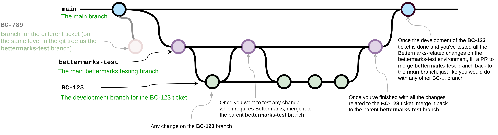
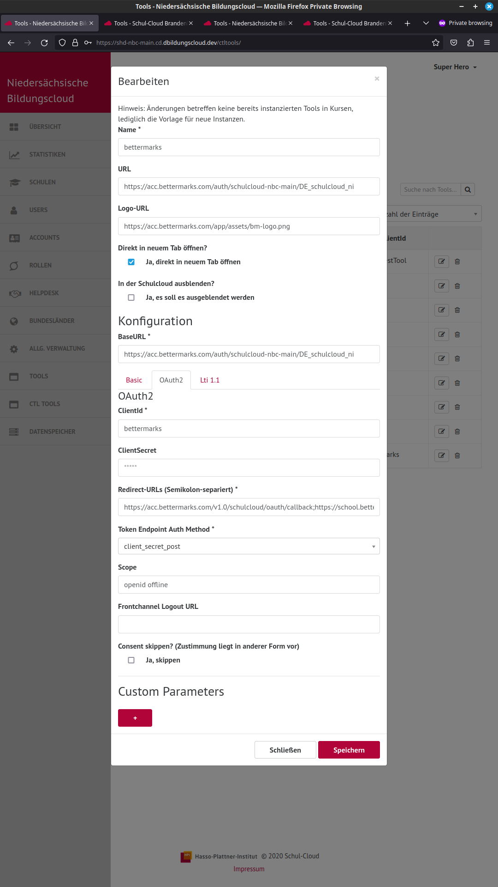
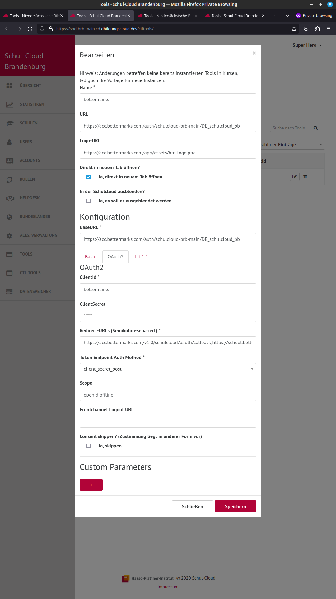
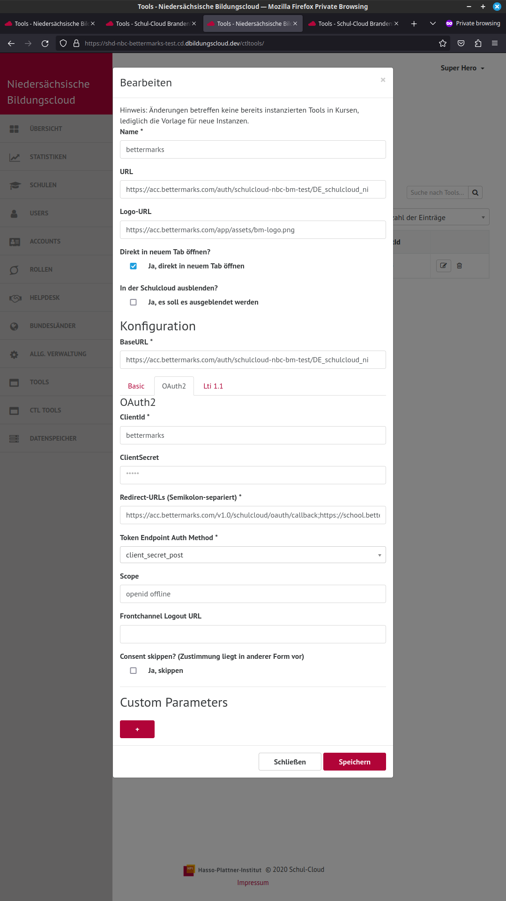
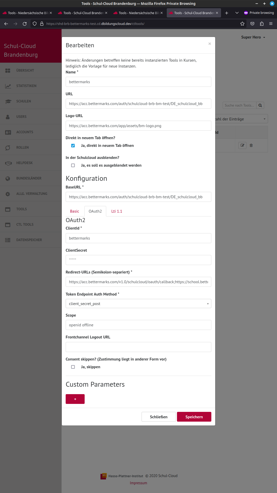

# Using Bettermarks on dev environments

There are 4 environments available to work with any of the Bettermarks tickets:

|  | bettermarks-test | dev |
|---|---|---|
| **nbc** | [https://bettermarks-test.nbc.dbildungscloud.dev/login](https://bettermarks-test.nbc.dbildungscloud.dev/login) | [https://main.nbc.dbildungscloud.dev/login](https://main.nbc.dbildungscloud.dev/login) |
| **brb** | [https://bettermarks-test.brb.dbildungscloud.dev/login](https://bettermarks-test.brb.dbildungscloud.dev/login) | [https://main.brb.dbildungscloud.dev/login](https://main.brb.dbildungscloud.dev/login) |

## Development Workflow

The main development workflow should be as follows:

1. When you start working on any ticket related to Bettermarks you should check if there is a **bettermarks-test** branch present in any of the repositories. If yes, this probably means that someone is also working on some ticket related to Bettermarks and you probably should contact this person to avoid unnecessary conflicts in code. If no, you can safely proceed straight to the next step.

2. Create a **bettermarks-test** branch in the repo that you will work in (diverged from the **main** branch like any other feature/bugfix branch) that should automatically create the testing environment and properly add the Bettermarks configuration in the database by the init deployment script.

3. Create a branch for your ticket, e.g. **BC-123**, diverged from the **bettermarks-test** branch to preserve some history about the whole ticket in the end.

4. Do any changes you need related to your BC-123 ticket on your **BC-123** branch.

5. Once you want to test any of the changes related to the Bettermarks, simply merge it to the **bettermarks-test** branch. Don't be afraid to merge it even after every commit - this branch was created just for this purpose and merging any changes to it shouldn't require any PR-process or anything - it should be treated just like any other BC-... branch.

   > **Important:** The testing environments are the ones created for the **[nbc](https://nbc-bettermarks-test.cd.dbildungscloud.dev/login)** and **[brb](https://brb-bettermarks-test.cd.dbildungscloud.dev/login)** instances - **it does not work on any other environment** (this would require more configuration on the Bettermarks side).

6. After testing any changes on the **bettermarks-test** branch either:
   - Go back to step No. 4 to continue making changes on your BC-123 branch if any are required, or
   - If you decide that your work on the ticket is done, proceed to the next step

7. Fill a PR to merge **bettermarks-test** to the main branch just like for any other BC-... branch PR.

8. Also please remember to delete the **bettermarks-test** branch after you merge it to the **main** branch - the configuration should still be included in the init job script and also on the Bettermarks side (I mean client secrets etc.) so there is no point in wasting the resources for the not used testing environment.

Below you can see a **git flow** diagram for a more illustrative explanation of the whole solution:



---

## Manual OAuth client configuration in SHD

### EDIT: The steps below were already automated, but I'll leave it here for the future reference if anyone will have a need to do it manually for some reason.

> **Be aware** that the configuration values in this part are out of date (Split of the dev clusters, Bettermarks Proxy now enabled). You can find the current ones in the [initscript](https://github.com/hpi-schul-cloud/schulcloud-server/blob/main/ansible/roles/schulcloud-server-init/templates/configmap_file_init.yml.j2) and the "server" 1Password items.

In the process of working on the [BC-3231](https://ticketsystem.dbildungscloud.de/browse/BC-3231) ticket, it turned out that additional OAuth client configuration is needed for Bettermarks to work. The configuration can easily be performed manually via SHD, below you can see the visual and text version of the whole configuration (except the secrets which are kept in **1Password** and should be taken from there if needed) for all of the four dev environments that Bettermarks should now work (**nbc-main**, **brb-main**, **nbc-bettermarks-test** and **brb-bettermarks-test**).

This step will also be automated, but it will be developed in a separate ticket ([BC-3299](https://ticketsystem.dbildungscloud.de/browse/BC-3299)) to not block release of the [BC-3231](https://ticketsystem.dbildungscloud.de/browse/BC-3231) which can fully work properly without automating this OAuth client configuration.

> **Please note** that this step is only needed if the Bettermarks' OAuth client in Hydra is not configured yet for a given environment. This means that it will only be needed upon recreation of the whole environment (or at least the parts where this OAuth configuration is kept).

### 1. nbc-main

SHD URL: [https://shd-nbc-main.cd.dbildungscloud.dev/ctltools/](https://shd-nbc-main.cd.dbildungscloud.dev/ctltools/)



```
Main section:

Name:       bettermarks
URL:        https://acc.bettermarks.com/auth/schulcloud-nbc-main/DE_schulcloud_ni
Logo-URL:   https://acc.bettermarks.com/app/assets/bm-logo.png
"Ja, direkt in neuem Tab öffnen" checked
BaseURL:    https://acc.bettermarks.com/auth/schulcloud-nbc-main/DE_schulcloud_ni

OAuth2 section:

ClientId:       bettermarks
ClientSecret:   <take it from the 1Password secrets called server (BETTERMARKS section at the bottom)>
Redirect-URLs:  https://acc.bettermarks.com/v1.0/schulcloud/oauth/callback;https://school.bettermarks.loc/v1.0/schulcloud/oauth/callback;https://acc.bettermarks.com/auth/callback;https://school.bettermarks.loc/auth/callback;https://acc.bettermarks.com/auth/oidc/callback
Token Endpoint Auth Method: client_secret_post
Scope:          openid offline
```

### 2. brb-main

SHD URL: [https://shd-brb-main.cd.dbildungscloud.dev/ctltools/](https://shd-brb-main.cd.dbildungscloud.dev/ctltools/)



```
Main section:

Name:       bettermarks
URL:        https://acc.bettermarks.com/auth/schulcloud-brb-main/DE_schulcloud_bb
Logo-URL:   https://acc.bettermarks.com/app/assets/bm-logo.png
"Ja, direkt in neuem Tab öffnen" checked
BaseURL:    https://acc.bettermarks.com/auth/schulcloud-brb-main/DE_schulcloud_bb

OAuth2 section:

ClientId:       bettermarks
ClientSecret:   <take it from the 1Password secrets called server (BETTERMARKS section at the bottom)>
Redirect-URLs:  https://acc.bettermarks.com/v1.0/schulcloud/oauth/callback;https://school.bettermarks.loc/v1.0/schulcloud/oauth/callback;https://acc.bettermarks.com/auth/callback;https://school.bettermarks.loc/auth/callback;https://acc.bettermarks.com/auth/oidc/callback
Token Endpoint Auth Method: client_secret_post
Scope:          openid offline
```

### 3. nbc-bettermarks-test

SHD URL: [https://shd-nbc-bettermarks-test.cd.dbildungscloud.dev/ctltools/](https://shd-nbc-bettermarks-test.cd.dbildungscloud.dev/ctltools/)



```
Main section:

Name:       bettermarks
URL:        https://acc.bettermarks.com/auth/schulcloud-nbc-bm-test/DE_schulcloud_ni
Logo-URL:   https://acc.bettermarks.com/app/assets/bm-logo.png
"Ja, direkt in neuem Tab öffnen" checked
BaseURL:    https://acc.bettermarks.com/auth/schulcloud-nbc-bm-test/DE_schulcloud_ni

OAuth2 section:

ClientId:       bettermarks
ClientSecret:   <take it from the 1Password secrets called server (BETTERMARKS section at the bottom)>
Redirect-URLs:  https://acc.bettermarks.com/v1.0/schulcloud/oauth/callback;https://school.bettermarks.loc/v1.0/schulcloud/oauth/callback;https://acc.bettermarks.com/auth/callback;https://school.bettermarks.loc/auth/callback;https://acc.bettermarks.com/auth/oidc/callback
Token Endpoint Auth Method: client_secret_post
Scope:          openid offline
```

### 4. brb-bettermarks-test

SHD URL: [https://shd-brb-bettermarks-test.cd.dbildungscloud.dev/ctltools/](https://shd-brb-bettermarks-test.cd.dbildungscloud.dev/ctltools/)



```
Main section:

Name:       bettermarks
URL:        https://acc.bettermarks.com/auth/schulcloud-brb-bm-test/DE_schulcloud_bb
Logo-URL:   https://acc.bettermarks.com/app/assets/bm-logo.png
"Ja, direkt in neuem Tab öffnen" checked
BaseURL:    https://acc.bettermarks.com/auth/schulcloud-brb-bm-test/DE_schulcloud_bb

OAuth2 section:

ClientId:       bettermarks
ClientSecret:   <take it from the 1Password secrets called server (BETTERMARKS section at the bottom)>
Redirect-URLs:  https://acc.bettermarks.com/v1.0/schulcloud/oauth/callback;https://school.bettermarks.loc/v1.0/schulcloud/oauth/callback;https://acc.bettermarks.com/auth/callback;https://school.bettermarks.loc/auth/callback;https://acc.bettermarks.com/auth/oidc/callback
Token Endpoint Auth Method: client_secret_post
Scope:          openid offline
```