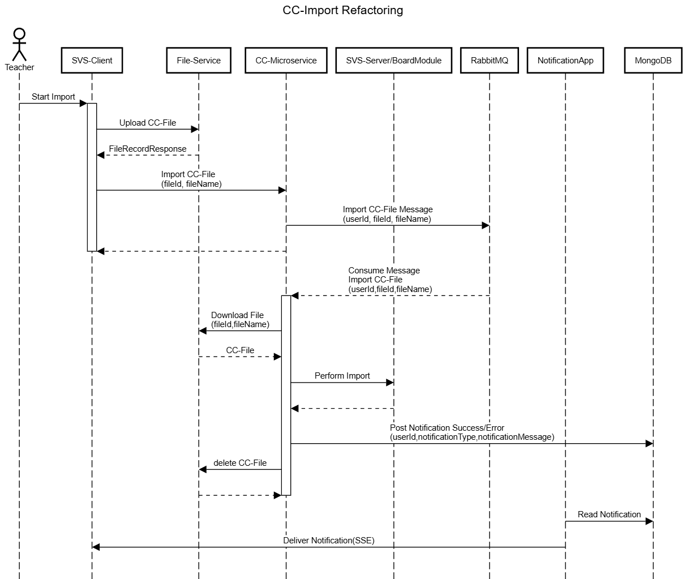

# How it works

## What is CommonCartridge

Common Cartridge is a 1EdTech Standard to share learning material between different systems. The details can be read up [here](https://docs.dbildungscloud.de/x/PhAlCw) in Confluence.

We currently support the import and export of (legacy) courses (especially Bereiche) and can use CommonCartridge versions 1.1 and 1.3.

## Functionality

The main functionality of the microservice is to translate SVS objects (mainly the structure and content of boards and their elements) into CommonCartridge Ressources and vice versa. This process covers almost all elements that are viable.

Excluded Elements include (but might not be limited to):
- CTL Tools
- Etherpads
- TL-Draw Elements
- H5P Content

## Implementation

Our Implementation of CommonCartridge comes in its own microservice, although the code is still in the schulcloud-server repository.
We start it as its own app and let it run alongside the server. It adheres to all coding conventions of the server, thus uses the same module structure and linter rules.

#### Note

This documentation demonstrates a state that is still in development. Especially the NotificationApp is still work-in-progress and will be documented seperately.

### Structure


### Operation Sequence



### API Clients

A notable feature of this microservice is the usage of several API clients, which are used to communicate to the server, specifically the course and board endpoints.

These clients are generated from the swagger documentation of their respective controllers and enriched to be used with our JWT Authentication.
All generated clients are currently located in the infra folder.

### Local Development

Development is done within the schulcloud-server repository. All rules for server development apply here as well

To start the microservice locally, use the commend

```
nest start common-cartridge --watch --
```
