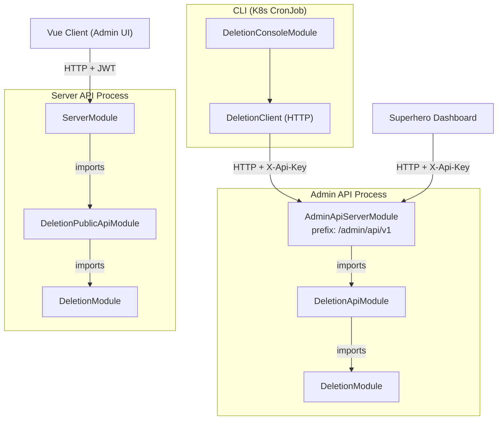
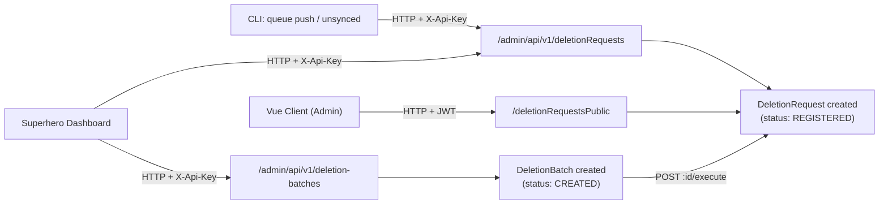
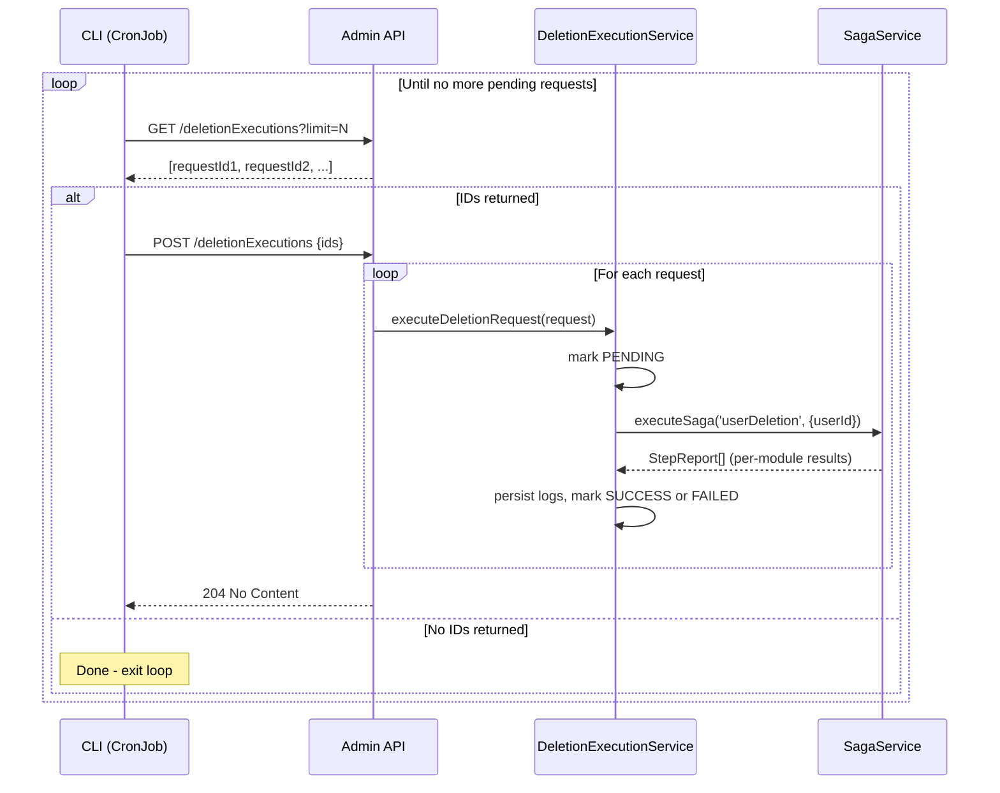
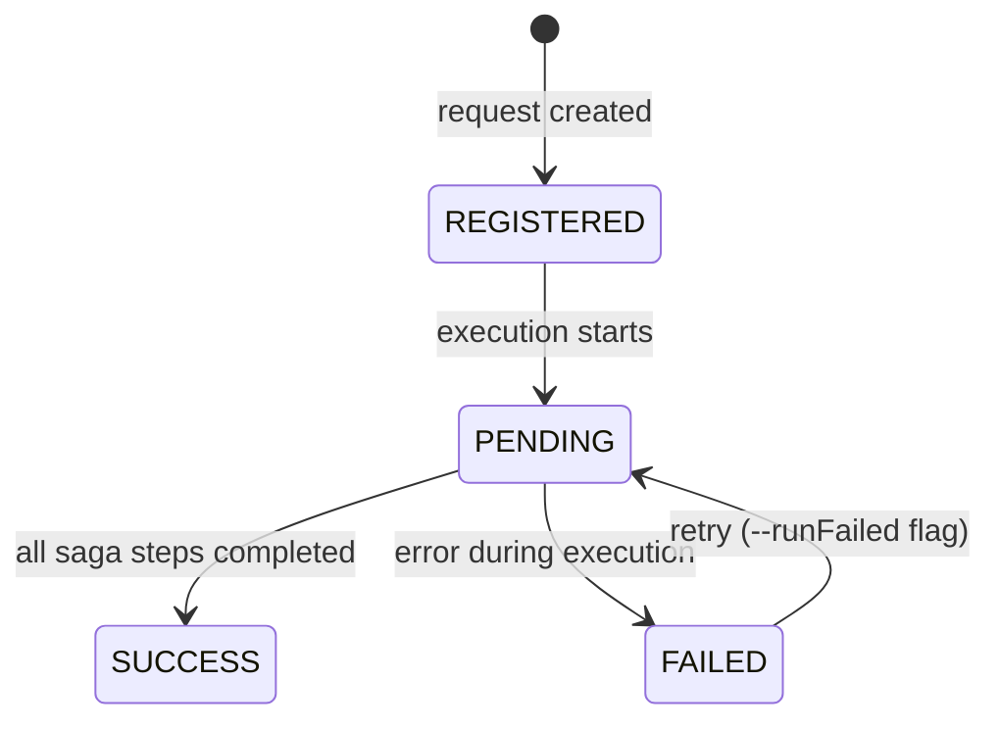

## System Overview

Three external callers, two processes:
- **Superhero Dashboard** and **CLI** both call the **Admin API** (X-Api-Key auth)
- **Vue Client** calls the **Server API** (JWT auth, admin role)

The Admin API runs as a **separate process** to prevent deletion workloads from impacting the main server.

---

## Components

### `DeletionConsoleModule` — CLI Tool

**Location:** deletion-console/
**Runs as:** Kubernetes CronJob

Provides two console command groups:

| Command | File | Purpose |
|---|---|---|
| `queue push` | deletion-queue.console.ts | Reads user IDs from a text file and enqueues deletion requests |
| `queue unsynced` | deletion-queue.console.ts | Finds users not synchronized with an external system and enqueues them |
| `execution trigger` | deletion-execution.console.ts | Triggers deletion execution in a paged loop |

The CLI does **not** access the database directly. It communicates exclusively with the Admin API via DeletionClient using HTTP + `X-Api-Key` authentication.

In practice, we only trigger the execution from the cron job
ansible/roles/schulcloud-server-core/templates/data-deletion-trigger-cronjob.yml.j2

---

### `DeletionApiModule` — Admin API Layer

**Location:** deletion/deletion-api.module.ts
**Lives in:** Admin API process (`AdminApiServerModule`)
**Auth:** `X-Api-Key`

Provides the full REST API for managing and executing deletions:

| Controller | Endpoints | Purpose |
|---|---|---|
| `DeletionRequestController` | `POST`, `GET :id`, `DELETE :id` | Manage deletion requests |
| `DeletionBatchController` | `POST`, `GET`, `GET :id`, `DELETE :id`, `POST :id/execute` | Manage deletion batches |
| `DeletionExecutionController` | `GET`, `POST` | Fetch pending request IDs + execute them |

Key UCs:
- **`DeletionRequestUc`** — creates individual deletion requests, deactivates the user account immediately
- **`DeletionBatchUc`** — manages batches; `requestDeletionForBatch()` creates the actual deletion requests for a batch and deactivates accounts
- **`DeletionRequestUc.executeDeletionRequests()`** — delegates to `DeletionExecutionService` for each request ID

---

### `DeletionPublicApiModule` — Server API Layer

**Location:** deletion/deletion-public-api.module.ts
**Lives in:** Server API process (`ServerModule`)
**Auth:** JWT (requires admin role)

| Controller | Endpoint | Purpose |
|---|---|---|
| `DeletionRequestPublicController` | `DELETE /deletionRequestsPublic?ids=...` | Create deletion requests from the Vue admin client |

This is a lightweight module — it imports `DeletionModule` to create requests but does **not** handle execution.

---

### `DeletionModule` — Domain Core

**Location:** deletion.module.ts
**Imported by:** `DeletionApiModule`, `DeletionPublicApiModule`

Provides domain services:

| Service | Responsibility |
|---|---|
| `DeletionRequestService` | CRUD + status transitions for deletion requests |
| `DeletionBatchService` | CRUD for batches + creating requests when a batch is started |
| `DeletionExecutionService` | Executes a single deletion request via the saga system |
| `DeletionLogService` | Persists per-domain deletion reports |

---

## Workflow

### 1. Creating Deletion Requests

Deletion requests can be created through three paths:

| Caller | Target API | Auth | Endpoints used |
|---|---|---|---|
| **CLI** (K8s CronJob) | Admin API | `X-Api-Key` | `POST /deletionRequests`, `GET/POST /deletionExecutions` |
| **Superhero Dashboard** | Admin API | `X-Api-Key` | `POST /deletionRequests`, CRUD `/deletion-batches`, `POST :id/execute` |
| **Vue Client** (school admin) | Server API | JWT (admin role) | `DELETE /deletionRequestsPublic?ids=...` |

The **Superhero Dashboard** is the primary admin UI that manages deletions — it creates individual requests, manages batches, and can trigger batch execution directly via the Admin API. The CLI automates the same API for scheduled/bulk operations as a CronJob.

### 2. Deletion Batches

Batches are a way to group multiple user IDs for deletion:

1. **Create batch** (`POST /deletion-batches`) — stores the list of user IDs, status: `CREATED`
2. **Start batch** (`POST /deletion-batches/:id/execute`) — this is when individual `DeletionRequest` entries are actually created for each user in the batch, and accounts are deactivated
3. After that, the requests are picked up by normal execution

---

### 3. Executing Deletions

Execution is triggered by the CLI as a **K8s CronJob**:

**Why paging?** Each page is executed in a separate HTTP request to prevent overloading the Node.js event loop. The CLI loops through pages until all due requests are processed.

**Request status lifecycle:**

Failed requests can be retried via the `execution trigger --runFailed` CLI flag, which picks up requests with status `FAILED` instead of `REGISTERED`. Note: This feature is work in progress and currently not used in production.