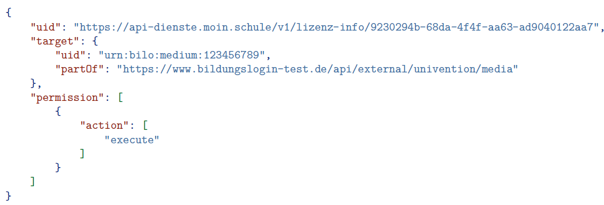
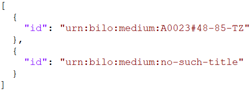
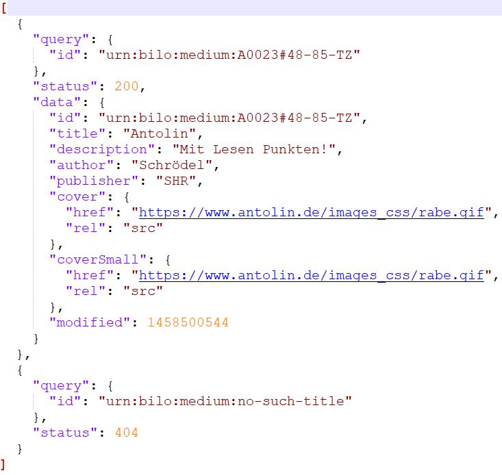

# Bilo Integration

This integration requires the following components in SVS:

* Ad-hoc provisioning: During provisioning, authorization-data for BiLo-media is transferred from moin.schule to SVS. Optionally, CTL tools linked to BiLo-media are activated in schools.
* SHD-Client: Superhero creates CTL tools linked to BiLo-media in this client.
* Metadata-Update-Batch: A background batch is used to update metadata for BiLo-media.

### Requirements
The following requirements must be met for the integration of BiLo-media into SVS:
* BiLo must provide an LTI-tool so that SVS can access the media.
* Superhero must create a CTL-tool to enable BiLo's LTI-tool to be used in SVS.
* moin.schule must provide media-authorization-data for BiLo-media.
* Users must have media-authorization-data for BiLo-media they want to access.


### Technical Specifications
#### LTI-Tool to access BiLo content
The following table shows the configuration-parameters to be used for an external tool to allow access to a BiLo-medium.

| name                                   | optionality | description                                  | value or value example              | comment                                       |
|----------------------------------------|-------------|----------------------------------------------|-------------------------------------|-----------------------------------------------|
| lti_message_type                       | mandatory   | LTI Message Type                             | basic-lti-launch-request            | constant                                      |
| lti_version                            | mandatory   | LTI Version                                  | LTI-1p0                             | constant                                      |
| oauth_consumer_key                     | mandatory   | LTI OAuth Key                                | c20c4798-fe4a-4d59-b27d-67f1ecd1fc2f | constant (production environment)             |
| oauth_consumer_secret                  | mandatory   | LTI Secret for signing/verification          | `<secret>`                          |                                               |
| resource_link_id                       | mandatory   | Link ID                                      | alfonslernwelt_mathe                | automatically generated value in SVS          |
| resource_link_title                    | optional    | Link-Titel                                   |                                     | unused                                        |
| context_id                             | mandatory   | Klassen- oder Arbeitsgruppen-ID              | nbc_moinschule_mathe                | constant                                      |
| context_title                          | mandatory   | Name der Klasse oder Arbeitsgruppe           | Mathematik                          | constant                                      |
| context_type                           | optional    | Typ der Gruppe (Klasse oder Arbeitsgruppe)   | Group                               | constant                                      |
| launch_presentation_document_target    | optional    | LTI Document Target                          | window                              | unused                                        |
| launch_presentation_locale             | mandatory   | LTI Presentation Locale                      | de-DE                               | constant                                      |
| custom_product_id*                     | mandatory   | BiLo Produktkennung / Produktcode            | urn:bilo:medium:WEB-14-129074       | Medium-ID in SVS                              |

#### How to pass medium-id to BiLo?
BiLo expects the "medium-id" to be passed as "custom_product_id" parameter to the LTI tool within the body of the request.
SVS' CTL implementation offers an auto-parameter "Medium Id". This parameter can be used to assign the "medium-id" to "custom_product_id" during runtime.
To achieve that, superhero must configure the parameter "custom_product_id" as following within SHD:
* Type: Medium Id
* Scope: Global
* Location: Body-Parameter
* Default: `<empty>`

The tool's base URL has the following format:

`<bilo-base>/api/v1/lti11/launch/{oauth_consumer_key}`

where, bilo-base is: https://route-resolver.services.bildungslogin.de

### Media authorization data
moin.schule provides an endpoint (policies-info) that is used to retrieve media-authorization-data.
SVS recognizes on the basis of this data which media an SVS user is allowed to access.
The following example shows how media-authorization-data for a single medium is passed to SVS:



where:
* target.partOf - media catalog id (external source for this media)
* target.uid - medium id (unique id of a medium within an external source for this medium)
* permission -	is currently ignored

Media-authorization-data is stored within the following MongoDB-collection: **user-licenses**.

Authorization data example:
```json
{
  "_id": {
    "$oid": "67c588bf14fa72a7a615...."
  },
  "type": "media-license",
  "createdAt": {
    "$date": "2025-03-03T10:47:27.707Z"
  },
  "updatedAt": {
    "$date": "2025-03-03T10:47:27.707Z"
  },
  "user": {
    "$oid": "67c588bf849910ed6d0...."
  },
  "mediumId": "Media2",
  "mediaSource": {
    "$oid": "67c588bf14fa72a7a615...."
  }
}
```

### Media metadata
SVS provides a metadata-update-batch that refreshes metadata of all BiLo media.

For this purpose, an interface provided by BiLo is called and the medium-id of a specific medium to be updated is passed.

The updated metadata is stored in MongDB-collection "external-tools" includes the following attributes:

* name
* description
* logo*
* logoUrl*
* medium.publisher
* medium.metadataModifiedAt

*) Both attributes stores the source and the belonging data of a logo-image within MongoDB.


---
**_Update-Restrictions:_**
Due to technical restrictions in SVS currently the file-service cannot be used within a background-job.
Therefore metadata-update-batch is not able to update images stored in S3.
---


metadata-update-batch is to be called at regular intervals in order to keep the metadata up to date automatically.

#### Job configuration
The automatic update job responsible for calling the BiLo API is implemented as a Kubernetes CronJob in the schulcloud-server repository, under an Ansible role named media-metadata-sync.

##### Enabling/Disabling the CronJob
The execution of this CronJob can be selectively enabled or disabled for different environments or instances. This is managed by configuring the role in the corresponding role group, host, and instance configurations within the dof_app.

##### Job Scheduling
Currently, the CronJob is triggered automatically once a day, during the early morning hours. Its execution time and frequency can be adjusted by modifying the environment variable:

SERVER_MEDIA_METADATA_SYNC_CRONJOB_SCHEDULE
This variable needs to be updated in both the server repository and the dof_app.

##### Job Responsibilities
The **Kubernetes CronJob** is responsible for triggering a server-side console job that handles the actual task of fetching and updating media authorizations from the BiLo API.

The server sync job is implemented in the `@modules/media-sync-console` and `@modules/medium-metadata` modules of the server repository. It can also be manually triggered using the following command:

`npm run nest:start:sync:media-metadata`

#### Job Scheduling

Currently, the CronJob is triggered automatically once a day, during the early morning hours. Its execution (time) and frequency can be adjusted by modifying the environment variables:


WITH_MEDIA_METADATA_SYNC and SERVER_MEDIA_METADATA_SYNC_CRONJOB_SCHEDULE

These variables need to be updated in both the server repository and the dof_app.


#### BiLo Connector Client
The connector client is implemented in the @infra/bilo-client. The client is generated out of the OpnApi definition of the bilo API:

#### Feature Flag for Metadata
A feature flag has been implemented to control FEATURE_MEDIA_METADATA_SYNC_ENABLED. This flag allows administrators to enable or disable access as needed.

#### Prerequisite: Media-Source
A prerequisite for the job is a defined BiLo media-source object stored manually in the database. Currently, there is no API available to create the media-source programmatically.

### BiLo interface
BiLo provides an endpoint for querying metadata for media.

Media-IDs in BiLo URN format (prefix:bilo:urn:medium) must be passed into the search query.

Example:


A result is returned for each medium-ID specified within the query.

If successful, medium metadata, otherwise the results "not found" or "error number" are returned.

Example:



#### Connection configuration

BiLo interface requires OAuth authentication therefore appropriate Client ID and Client Secret must be known.

To be able to call BiLo-Interface a Client Credentials Grant token must be obtained from authentication endpoint.

All connection data required for BiLo is saved within MongoDB-collection "media-sources" as embedded object: "oauthConfig".

The following connection-attributes are specified in oauthConfig:

authEndpoint	String	Authentication endpoint URL
method	String	Authentication method: "CLIENT_CREDENTIALS"
baseUrl	String
Url of BiLo interface

clientId	String	ClientId for OAuth authentication
clientSecret	String	Encrypted secret for OAuth authentication


Prod- and ref-environment are managed by DevOps.

### Implemented use-cases
#### Working with BiLo within SVS
The following pre-conditions must be met:

* BiLo's base URL, client-id and client-secret are known
This is required to be able to communicate with BiLo.

* BiLo's internal and unique medium-id (passed to BiLo as → custom_product_id parameter) is known
This identifies a specific content (medium) in BiLo.

* BiLo's authorization data for the medium is available for user that will access the medium
This tells SVS that user is allowed to access a specific medium in BiLo.
If a user tries to access a medium within BiLo without being authorized, then BiLo would reject access.

#### Making a BiLo medium available in an SVS instance
The following workflow was agreed:
* Superhero configures an external LTI Tools (→ BiLo-Tool) and sets the appropriate BiLo-URL as base URL
and other LTI parameters
* Superhero configures Medium-Id and Medienkatalog-Id
* Superhero configures medium's metadata as description or preview picture
* Superhero configures a user defined parameter: custom_product_id


#### Making a BiLo medium available within a school
Manual option
* School admins enables a specific BiLo-Tool within their schools
Automatic option
* School activates automatic-external-tool-provisioning within their schools
* A user that has authorization data for a specific BiLo medium logs in to SVS via moin.schule
SVS automatically ensures that appropriate BiLo-Tool is enabled in the related school.


#### Making a BiLo medium available in a school-context
Manual option
* Teacher adds an appropriate BiLo-Tool to a school-context (e.g. a board card or a course)

Automatic option
* SVS automatically determine available tools and offers a BiLo-Tool within user's media-shelf

#### Updating authorization data for BiLo media
SVS updates authorization data for BiLo during user's login to SVS as part of ad-hoc provisioning.

The following cases are supported:

* Authorization data for a medium is unknown in SVS
The activation data is assigned to current user.

* Authorization data for a medium that is known in SVS is not returned from moin.schule
The activation data is removed from current user.

* Moin.schule does not return any authorization data for BiLo
All BiLo activation data is removed from current user.


#### Updating meta data for BiLo media
* Manual option: Superhero configures medium's metadata as description or preview picture in SHD.
* Automatic option: SVS automatically updates metadata for all defined BiLo media in background.

#### Working with BiLo within moin.schule
Each BiLo-Medium that is to be made available in SVS must be defined as a service in moin.schule.

The service must have a Medien-ID and a Medienkatalog-ID set.

The service must in turn be assigned to the school concerned and be assigned to the desired user group there.

The following assignments are possible:
* Entire school
* Groups
* Individual users
* No assignment

### Risks and Assumptions
* Identified risks and their management
  * Media authorization data is managed by moin.schule and provisioned to SVS during login.
  If a larger amount of data must be updated, then this could slow down the login process.
  * If moin.schule does not deliver media authorization data, then this data is removed from user during login during ad-hoc-provisioning.
In case authorization data was removed, users will not be able to access BiLo media from SVS.

### Conclusion
* Support for BiLo media was integrated in SVS
* moin.schule transfers BiLo's media authorization data to SVS during ad-hoc provisioning
* Optionally external tools linked to BiLo media are assigned to schools automatically, when required
* Media's metadata can be updated manually in SHD-Client and will be updated on regular basis in background
