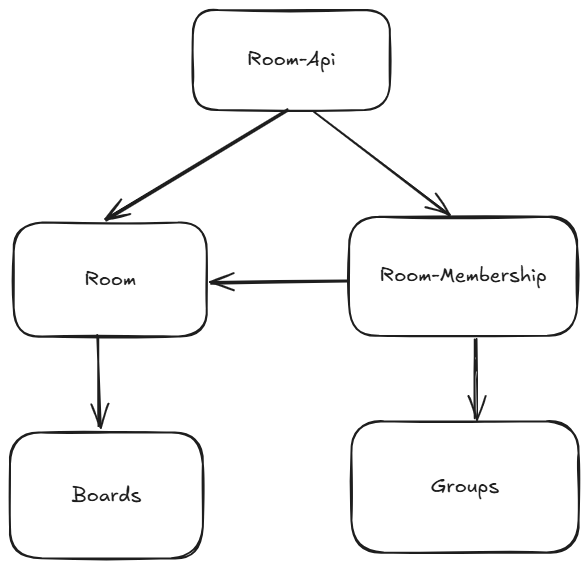

# Overview

## Introduction

Rooms are digital spaces where people can interact and collaborate, designed both for Teachers and Students during and outside of lesson, and for collaboration between Teachers.

Each room has a number of members in various roles, and content in the form of collaborative boards, as well as some configuration that governs what features are available, how these features work, and what roles can interact with them.

## Modules

There are five Modules working together in Rooms.

- The Rooms-API is the entry point for all requests regarding the Room (note that the boards have their own API). Read more about [API Modules](../../backend-design-patterns/architecture.md#api-modules) for more information.

- The Room module is responsible for the Room object itself. It contains the configuration of the room, and references to all content that belongs to the room.

- The Room-Membership module is essentially a bridge between `Groups` and `Rooms`. It utilizes the `Groups` module to store the users of a room and their roles, while containing any user related logic specific to rooms. It's responsible to construct the `RoomAuthorizable.do`, which plays a major part in all authorization checks for the room.

- The Boards are a feature that allows the creation and collaborative work on structured content.

- The Groups module provides an abstraction to store groups of users with their context-specific roles. It is used to store which roles a user has in what room.

## Roles

The Room uses its own roles, that can be assigned independently of school roles. Note however that there might be business restrictions on who can have which role based on their school role, such as students never being owner of a room.

The roles follow a linear hierarchy, meaning a higher role can do anything a lower role is able to do. The roles are as follows:

### Room Owner

There can always be only one owner. The owner has to be a teacher, ensuring that there is at least one teacher in the room for supervision.

The owner has all permissions within the room, but can not leave without passing ownership to another teacher first. Should a room ever be without owner, no other user is allowed to access the room, until a school administrator has assigned a new owner.

### Room Admin

The admin can add and manage the users in the room, and the settings of the room.
To add students from another school to a room, it is necessary to grant a teacher from that school the Room Admin role, so that he can invite students from his school.

### Room Editor

The editor is someone who is responsible for and can edit all content in the room.
In a school context, a teaching person should have at least the editor role.

### Room Viewer

The viewer is a consumer of the room. That generally means he can't edit content within the room, though some content may allow viewers to do so.

In a school context, this is the role a student is intended to have.

### Room Applicant

The Applicant is not yet a member of the room, but needs to be confirmed by an admin.

## Cross-School Operation

Each room is part of exactly one school. It is however possible to add users from other schools to a room, should that be necessary.

When a user from another school is added to a room, he is also added as a *guest* to the school. Only Users with any role on the room's school, including guests, may access a given room.

A user is only allowed to add another user when he is either in the same school as that user, or if that user is a publicly visible teacher.

Let's consider an example where `Teacher A` is owner of `Room A` at `School A`, and needs to add Users from `School B`.

`Teacher A` is not allowed to see or add `Student B` from the other school. He can however add `Teacher B` from the other school (if that teacher is publicly visible), and give him the Room Admin role.

`Teacher B` can then add more users, including `Student B` from his own school to the Room.

Once in a Room, users can interact with the content of the room no matter their original school.
