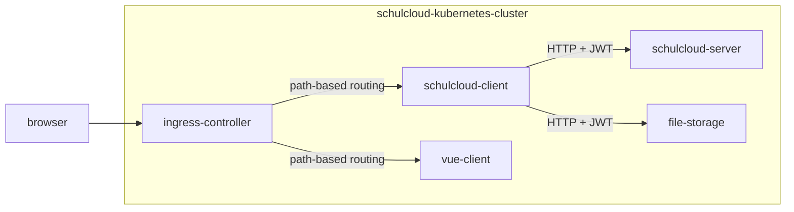

# Overview

The schulcloud-client is the Schulcloud's legacy frontend (and thus often called "legacy client"). Most pages are already migrated to the [vue-client](../vue-client/) and all new work should happen there.

## Technical Overview

It is a client-server application based on [Handlebars](https://handlebarsjs.com/) and [Express.js](https://expressjs.com/en/). 

The integration of Handlebars with Express is done with handlebars-wax as described in [this paragraph from the handlebars-wax-docs](https://github.com/shannonmoeller/handlebars-wax#enginefile-data-callback-handlebarswax).

Static files are built with [gulp.js](https://gulpjs.com/).

## Integration in the Schulcloud

As shown above the ingress-controller of the kubernetes-cluster routes to the respective client based on the path. The current routing can be found in the [config for the ingress-controller](https://github.com/hpi-schul-cloud/dof_app_deploy/blob/8cdc7455d60fdbb74d048f68116cb3b98d46b4b1/ansible/group_vars/all/x_ingress.yml).

The schulcloud-client communicates with schulcloud-server and file-storage inside the cluster. All communication is via HTTP and authenticated via JWT.

## Theming

The client can display the site with different themes. The files for each theme are placed in the `/themes` directory. The theme is selected with the env var `SC_THEME`.

## Local Setup

Clone the [repository](https://github.com/hpi-schul-cloud/schulcloud-client) and proceed like described in the README.

For a minimal setup the [schulcloud-server](https://github.com/hpi-schul-cloud/schulcloud-server/blob/33ffddf7aca4a0118ee312f53efbb616a1dcc630/package.json#L49) and the [vue-client](https://github.com/hpi-schul-cloud/nuxt-client/blob/c10852e7cf9cd8646b8511a534b5c4eb7ee3e9e1/package.json#L8) must be running, for a full setup also the [file-storage](https://github.com/hpi-schul-cloud/file-storage/blob/cb9e6345b120a76667ed80df0056f338c930e827/package.json#L23).

### Changing the theme

To change the theme you have to set `SC_THEME` in your local environment. E.g. for `n21` run the following commands:
1. `SC_THEME=n21 npm run build`
1. `SC_THEME=n21 npm start`