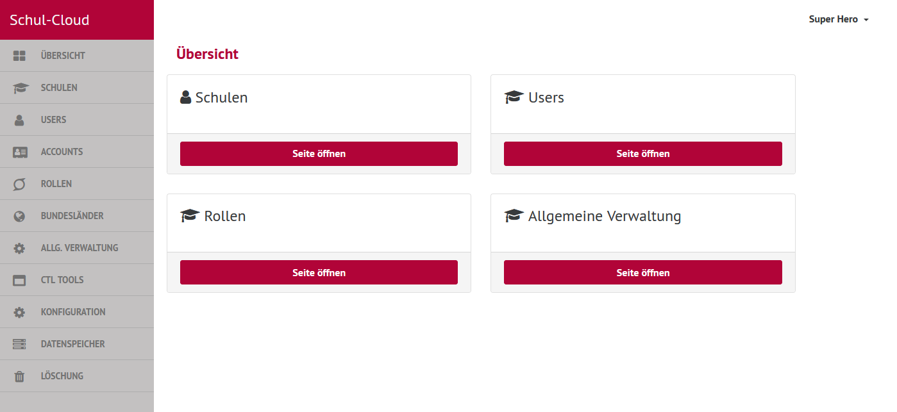
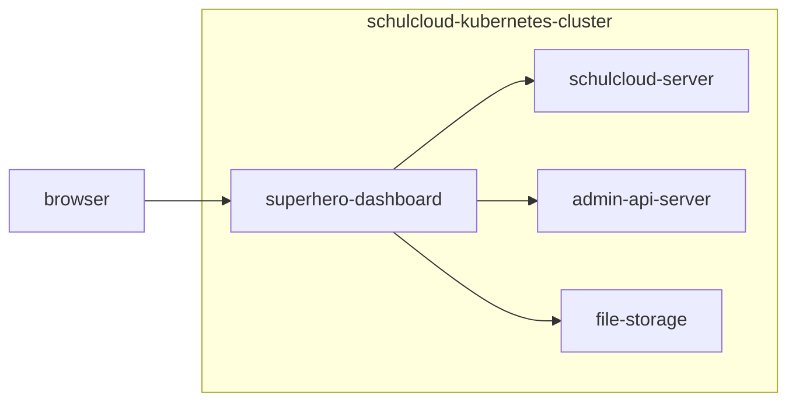

# Overview

The superhero-dashboard (short SHD) is the UI for instance-wide configuration and data manipulation. It is used by users with the role "superhero", which is basically the support team.

## Technical Overview

It is a client-server application based on [Handlebars](https://handlebarsjs.com/) and [Express.js](https://expressjs.com/en/). 

The integration of Handlebars with Express is done with handlebars-wax like described in [this paragraph from the handlebars-wax-docs](https://github.com/shannonmoeller/handlebars-wax#enginefile-data-callback-handlebarswax).

Static files are built with [gulp.js](https://gulpjs.com/).

## Integration in the Schulcloud

Like shown above the superhero-dashboard communicates with the following schulcloud-apps:
- [schulcloud-server](https://github.com/hpi-schul-cloud/schulcloud-server/blob/33ffddf7aca4a0118ee312f53efbb616a1dcc630/package.json#L49)
- [admin-api-server](https://github.com/hpi-schul-cloud/schulcloud-server/blob/33ffddf7aca4a0118ee312f53efbb616a1dcc630/package.json#L53) (for user-batch-deletion)
- [file-storage](https://github.com/hpi-schul-cloud/file-storage/blob/cb9e6345b120a76667ed80df0056f338c930e827/package.json#L23) (for school-files-deletion)

All communication is via HTTP inside the kubernetes-cluster.

## HTTP Basic Auth
Unlike other schulcloud-apps the superhero-dashboard is protected by [HTTP Basic Auth](https://developer.mozilla.org/en-US/docs/Web/HTTP/Guides/Authentication) on deployed instances like configured [here](https://github.com/hpi-schul-cloud/superhero-dashboard/blob/b4d7f1fcc1dd6862b5cc7f0837654c25abd0bdd6/ansible/roles/superhero-dashboard/templates/ingress.yml.j2#L10).

## Environment Variables
- PORT
- BODYPARSER_LIMIT
- BACKEND_URL
- FILES_STORAGE_API_URL
- ADMIN_API_URL
- ADMIN_API_KEY
- SC_NAV_TITLE
- SC_THEME
- FEATURE_MEDIA_SHELF_ENABLED
- FEATURE_USER_LOGIN_MIGRATION_ENABLED
- FEATURE_SHOW_OUTDATED_USERS
- FEATURE_ENABLE_LDAP_SYNC_DURING_MIGRATION

Defaults are set where the variables are used in the code.

## Local setup

Clone the [repository](https://github.com/hpi-schul-cloud/superhero-dashboard) and proceed like described in the README.

For a minimal setup the schulcloud-server must be running, for a full setup also the admin-api-server and the file-storage (see "Integration in the Schulcloud" above). 

The defaults of the environment variables are fine for the normal local setup.
